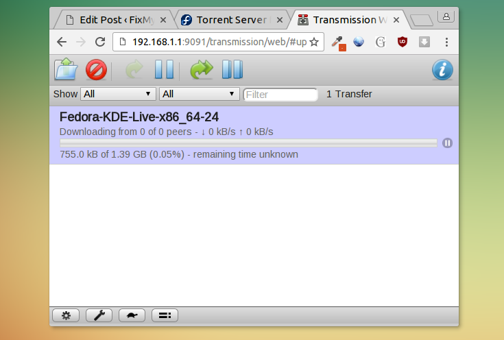
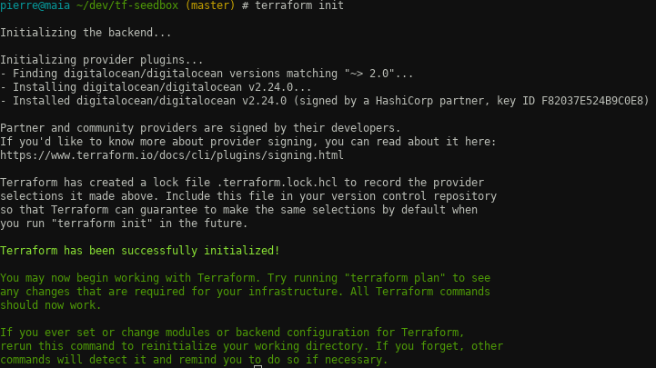
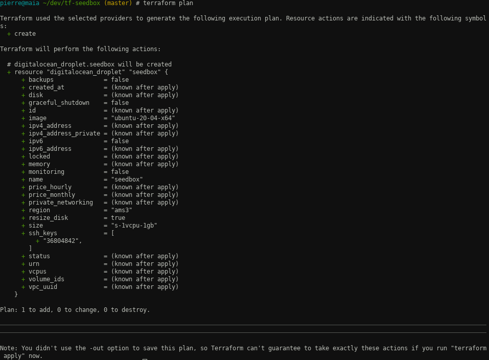
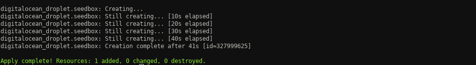
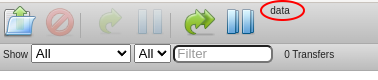
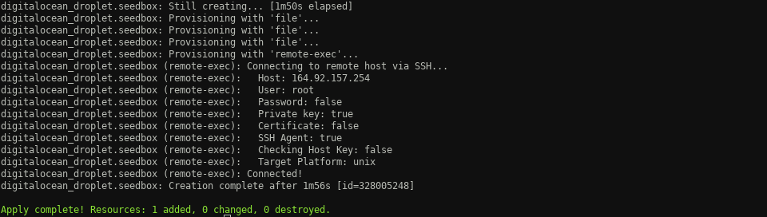

TLDR, [show me the code](https://github.com/k3roulas/seedbox-terraform-digital-ocean)

This article assume you are using linux or Windows subsystem for linux.

We are going to write scripts to create a torrent seedbox in the cloud. The seedbox will run Transmission web and a Nginx server to expose the download directory.

These scripts will be consume by one terraform command to create or destroy the seedbox.

[Transmission](https://transmissionbt.com) is a lightweight open source torrent client with multiple interfaces (CLI/WEB/Desktop). Transmission web has a user friendly UI :



[Terraform](https://www.terraform.io/) is a software developed by Hashicorp that proposes infrastructure as code. You create a declarative script and by running terraform commands, the infrastructure is created.

When creating scripts for an infrastructure, for example AWS, you could use the AWS API, but you will not be able to reuse your scripts on another Cloud provider. A terraform script can be run against different providers : AWS, Google Compute Engine, Alibaba Cloud, Digital Ocean ... The idea is to code your infrastructure once and reuse it everwhere, any serious cloud provider can interact with Terraform, look at the [full list of providers](https://registry.terraform.io/browse/providers).

We are using [Digital Ocean](https://www.digitalocean.com/), cheap but fast and reliable cloud infrastructure provider.

## Preparation

Before we write any script, some configuration is needed on the Digital Ocean console.

Generate a API token from https://cloud.digitalocean.com/account/api/tokens, call it "seedbox_tf_token"

You need to create new ssh keys. Run the following command in a terminal, when prompted for a name enter : "seedbox_tf" and leave the passphrase empty.

```bash
ssh-keygen
```

Move your keys in the directory ~/.ssh/, if it does not exist, create it and change permissions to 700.

Upload the public ssh key (seedbox_tf.pub) on your Digital Ocean security page : https://cloud.digitalocean.com/account/security with the name "seedbox_tf"

Follow the instruction to [install terraform](https://developer.hashicorp.com/terraform/downloads)

## Provider

Now we are ready to start writting the terraform scripts. First create a file to setup your variables, "terraform.tfvars" :

```terraform
api_key="...your_api_key"
ssh_key_path="...path_to_your_ssh_file"
do_ssh_name="seedbox_tf"
```

Then create a provider, in our case, setup with digitalocean source, "provider.tf" :

```terraform
variable "api_key" {}
variable "ssh_key_path" {}

provider "digitalocean" {
    token = var.do_token
}

data "digitalocean_ssh_key" "terraform" {
  name = "seedbox_tf"
}

terraform {
  required_providers {
    digitalocean = {
      source = "digitalocean/digitalocean"
      version = "~> 2.0"
    }
  }
}
```

Let's init the terraform project :

```bash
terraform init
```



If the connection is not successful, run it again but increase verbosity by setting the environment variable :

```bash
export TF_LOG=TRACE
```

## Seedbox

Continue when the connectivity is sucessful, create a file "seedbox.tf" with :

```terraform
resource "digitalocean_droplet" "seedbox" {

    image = "ubuntu-20-04-x64"
    name = "seedbox"
    region = "ams3"
    size = "s-1vcpu-1gb"
    ssh_keys = [
        data.digitalocean_ssh_key.terraform.id
    ]

    connection {
        host = self.ipv4_address
        user = "root"
        type = "ssh"
        private_key = file(var.ssh_key_path)
        timeout = "2m"
    }

}
```

It declares the characteristics of the host. Use https://slugs.do-api.dev to list the possible values.

Here, we use the linux distribution Ubuntu LTS 20.04 in Amsterdam3 datacenter. The digital ocean droplet name will be "seedbox" and the size is 1VCPU 1G RAM.

The connection section declares how terraform will connect to the host to do the installation.

Run the command :

```bash
terraform plan
```



Terraform displays what is going to be apply and list with a green cross what is going to change.

Apply by running :

```bash
terraform apply
```



Congratulation the host is created.

Show caracteristics of the host :

```bash
terraform show
```

Note the IP address, and verify you can connect to the host from localhost :

```bash
ssh -i ~/.ssh/seedbox_tf root@IP
```

The seedbox is up and running, but Transmission and Nginx are missing. Making changes in the "seedbox.tf" will not trigger any change by Terraform, it is a provisioning tool and if you want to update a resource you have to destroy and re-create it.

```bash
terraform plan -destroy -out destroy && terraform apply destroy
```

Let's install and configure Nginx and Transmission packages.

"seedbox.tf" :

```terraform
resource "digitalocean_droplet" "seedbox" {
    image = "ubuntu-20-04-x64"
    name = "seedbox"
    region = "ams3"
    size = "s-1vcpu-1gb"
    ssh_keys = [
        data.digitalocean_ssh_key.terraform.id
    ]

    connection {
        host = self.ipv4_address
        user = "root"
        type = "ssh"
        private_key = file(var.ssh_key_path)
        timeout = "2m"
    }

    # install Nginx and Transmission
    # and stop transmission service
    provisioner "remote-exec" {
        inline = [
        "apt update",
        "apt install -y nginx transmission-cli transmission-common transmission-daemon",
        "service transmission-daemon stop"
        ]
    }

    # overwrite Transmission service with a local file
    provisioner "file" {
        source      = "settings.json"
        destination = "/etc/transmission-daemon/settings.json"
    }

    # overwrite Nginx configuration file with a local file
    provisioner "file" {
        source      = "default"
        destination = "/etc/nginx/sites-available/default"
    }

    # overwrite Transmission theme
    provisioner "file" {
        source      = "config/transmission/index.html"
        destination = "/usr/share/transmission/web/index.html"
    }

    # restart Transmission and nignx
    provisioner "remote-exec" {
        inline = [
        "service transmission-daemon start",
        "service nginx restart",
        ]
    }
}
```

Each provider in this file are executed in their order, we first install Nginx and Transmission.

To relax the security of the default Transmission configuration, changes on /etc/transmission-daemon/settings.json are require.

```
  "rpc-authentication-required": false,
  "rpc-host-whitelist-enabled": false,
  "rpc-whitelist-enabled": false,
```

Download this [file](https://github.com/k3roulas/seedbox-terraform-digital-ocean/blob/master/config/transmission/settings.json) containing the changes above on your local environment and name it settings.json.

In order for Transmission to take into account the new "settings.json" file, we need to stop the service and restart it ("service transmission-daemon stop" and "service transmission-daemon start")

In your local environement create the Nginx configuration file "default" with the location /www pointing to the Transmission download directory. When calling http://IP/www you will be able to browse and download files from the Transmission downloaded directory.

```nginx
server {
listen 80 default_server;
listen [::]:80 default_server;
    root /var/www/html;

    location /www {
    	alias /var/lib/transmission-daemon/downloads/;
    	autoindex on;
    }

    index index.html index.htm index.nginx-debian.html;
    server_name _;
    location / {
    	try_files $uri $uri/ =404;
    }
}
```

We also update the Transmission theme to allow a link redirecting to the downloaded Transmission directory, download the [file](https://github.com/k3roulas/seedbox-terraform-digital-ocean/blob/master/config/transmission/index.html) and name it index.html. See the change here :



Now apply to create your seedbox :

```terraform
terraform apply
```



Get the IP of seedbox :

```bash
terraform show --json | jq '.values.root_module.resources[] | select(.name=="seedbox").values.ipv4_address'
```

Access the Transmission web UI :

http://your_ip:9091

Access the download directory :

http://your_ip/www

When you are done with the box, destroy it :

```bash
terraform plan -destroy -out destroy && terraform apply destroy
```
